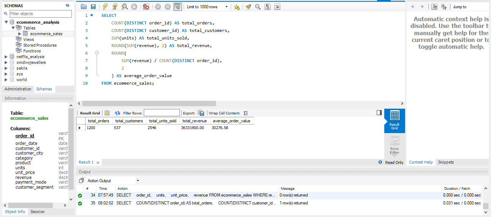
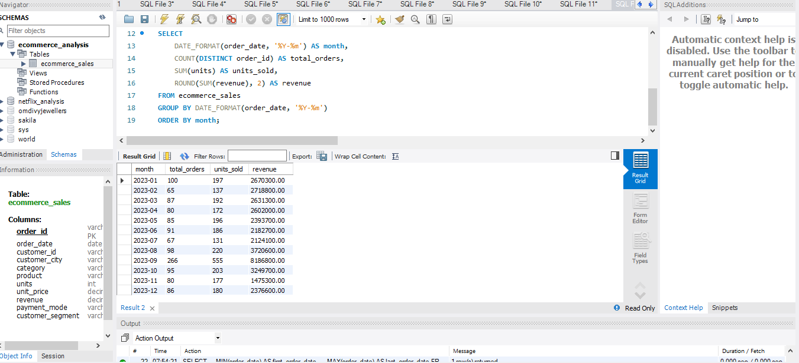
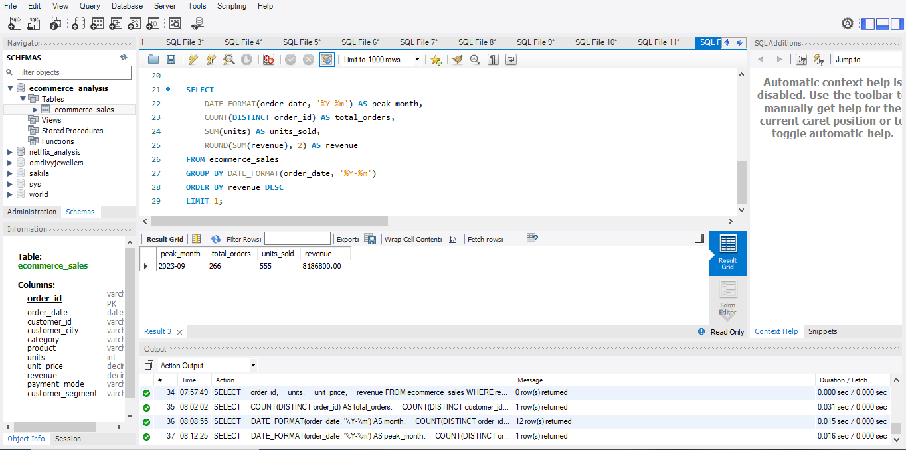
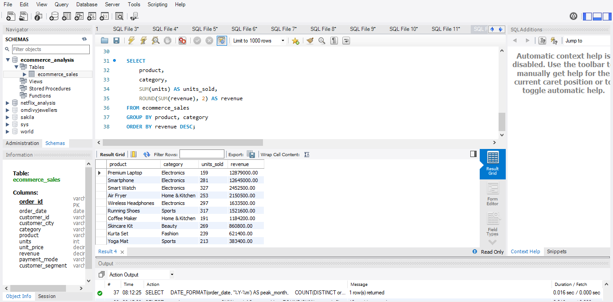
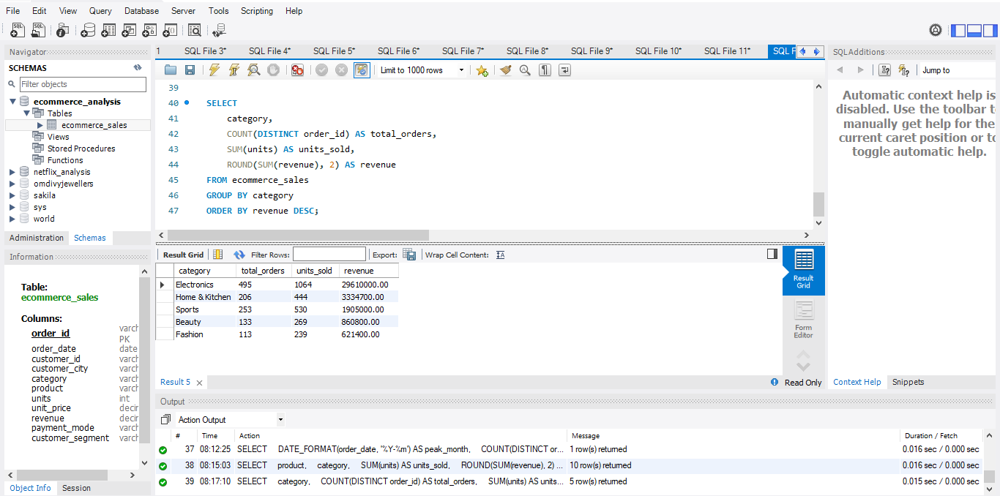
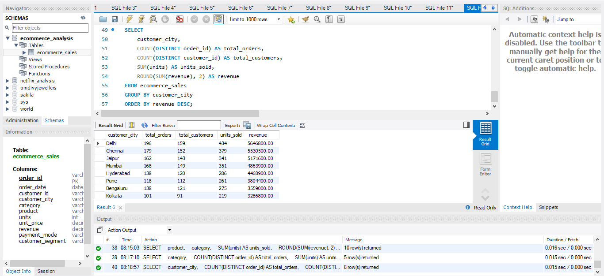
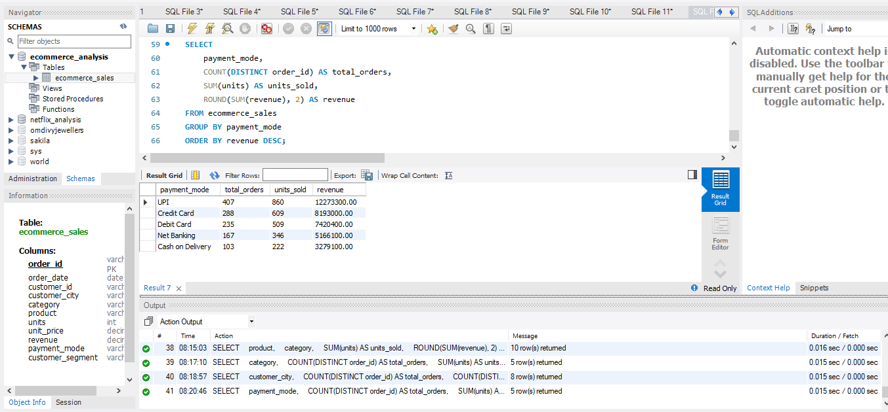
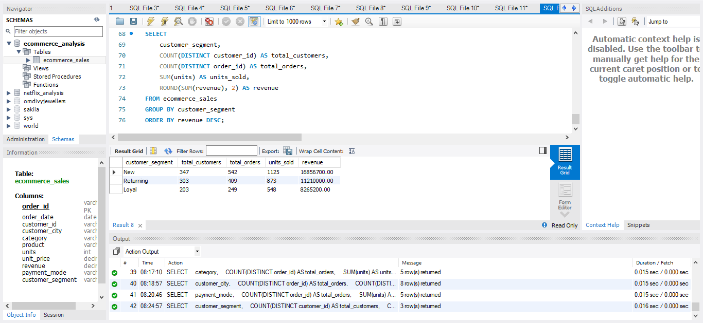
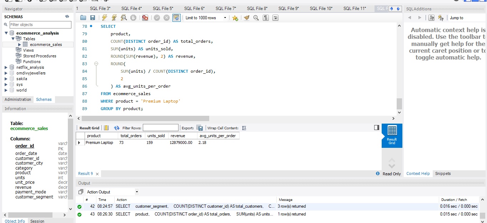
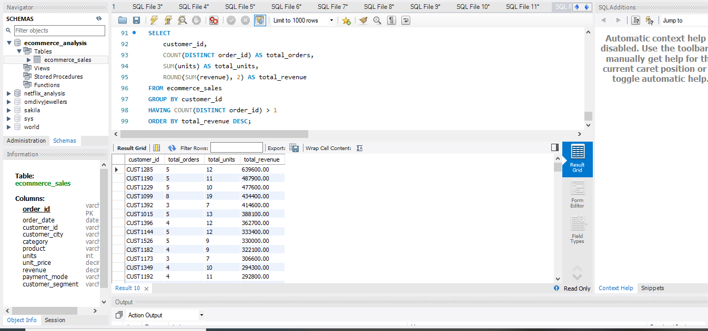

# 🛒 E-Commerce Sales Analytics


An end-to-end **E-Commerce Sales Analytics project** focused on analyzing sales performance, customer behavior, product performance, revenue trends, and business growth opportunities using **Python, MySQL, Excel, and Power BI**.

---

## 📌 Project Overview

This project analyzes an E-Commerce sales dataset to understand overall business performance and customer purchasing behavior.

The analysis focuses on:

* 💰 Overall sales and revenue performance
* 📈 Monthly revenue trends
* 🏆 Peak sales period
* 📦 Product performance
* 🏷️ Category performance
* 🌆 City-wise sales
* 💳 Payment method preferences
* 👥 Customer segment analysis
* 💎 Premium product performance
* 🔁 Repeat customer analysis

The project follows a complete data analytics workflow:

**Data Validation → Python Analysis → SQL Analysis → Excel Analysis → Power BI Visualization → Business Insights**

---

## 🎯 Project Objectives

The main objectives of this project are:

* Analyze overall sales performance
* Identify monthly revenue trends
* Find the peak sales month
* Identify top-performing products
* Compare category-wise performance
* Analyze city-wise sales
* Understand payment method preferences
* Analyze customer segments
* Evaluate premium product performance
* Identify repeat customer contribution
* Generate actionable business insights

---

## 📊 SQL Analysis Performed

MySQL was used to perform business-oriented SQL analysis.

The project includes SQL analysis for:

* Overall sales performance
* Monthly revenue trends
* Peak sales month
* Product performance
* Category performance
* City-wise sales
* Payment method analysis
* Customer segment analysis
* Premium product performance
* Repeat customer analysis

---

## 🧹 Data Validation

Before analysis, the dataset was validated for:

* Duplicate order IDs
* NULL values
* Invalid quantities
* Invalid prices
* Invalid revenue values
* Revenue calculation consistency
* Date range
* Categories
* Cities
* Payment methods
* Customer segments

These validation checks helped ensure that the dataset was accurate, consistent, and suitable for further analysis.

---

## 🐍 Python Data Analysis

Python and Pandas were used for data preparation, validation, and exploratory analysis.

### Main Tasks

* Loaded and inspected the dataset
* Checked dataset structure
* Validated data types
* Checked missing values
* Checked duplicate records
* Validated quantity and price values
* Verified revenue calculations
* Checked categorical values
* Prepared data for SQL and visualization

### Libraries Used

* Python
* Pandas
* NumPy
* Matplotlib

---

## 📸 SQL Analysis Screenshots

The following screenshots show the SQL queries and their corresponding analysis results.

### Overall Sales Performance



### Monthly Revenue Trend



### Peak Sales Month



### Product Performance



### Category Performance



### City-wise Sales



### Payment Mode Analysis



### Customer Segment Analysis



### Premium Product Analysis



### Repeat Customer Analysis



---

## 📊 Power BI Dashboard

The Power BI dashboard presents the analyzed data through interactive visualizations and business-focused KPIs.

### Dashboard Includes

* 💰 Revenue KPI
* 🛒 Total Orders
* 📦 Product Performance
* 🏷️ Category Performance
* 🌆 City-wise Sales
* 💳 Payment Method Analysis
* 👥 Customer Segment Analysis
* 💎 Premium Product Analysis
* 🔁 Repeat Customer Analysis
* 📈 Sales Trends
* 🎛️ Interactive Filters and Slicers

---

## 💡 Business Insights

The analysis helps identify important business patterns related to:

* Revenue performance
* Monthly sales trends
* Best-performing products
* High-performing categories
* Top-performing cities
* Customer payment preferences
* Customer segment contribution
* Premium product performance
* Repeat customer behavior

These insights can support business decisions related to:

* 📦 Inventory planning
* 🎯 Customer targeting
* 💰 Pricing strategy
* 📈 Sales planning
* 🛍️ Product promotion
* 🔁 Customer retention

---

## 🛠️ Tech Stack

| Technology  | Purpose                      |
| ----------- | ---------------------------- |
| 🐍 Python   | Data Analysis & Validation   |
| 🐼 Pandas   | Data Cleaning & Manipulation |
| 🔢 NumPy    | Numerical Analysis           |
| 🗄️ MySQL   | SQL Analysis                 |
| 📊 Power BI | Interactive Dashboard        |
| 📗 Excel    | Data Analysis & Reporting    |
| 🐙 GitHub   | Project Documentation        |

---

## 📂 Project Structure

```text
E-Commerce-Sales-Analytics/
│
├── dataset/
│   └── ecommerce_sales.csv
│
├── python/
│   └── data_analysis.py
│
├── sql/
│   └── ecommerce_analysis.sql
│
├── excel/
│   └── ecommerce_analysis.xlsx
│
├── powerbi/
│   └── ecommerce_sales_dashboard.pbix
│
├── screenshots/
│   ├── image1_Overall_Sales_Performance.png
│   ├── image2_Monthly_Revenue_Trend.png
│   ├── image3_Peak_Sales_Month.png
│   ├── image4_Product_Performance.png
│   ├── image5_Category_Performance.png
│   ├── image6_City-wise_Sales.png
│   ├── image7_payment_mode_analysis.png
│   ├── image8_Customer_Segment_Analysis.png
│   ├── image9_Premium_Product_Analysis.png
│   └── image10_repeat_customer_analysis.png
│
├── documentation/
│   └── business_insights.md
│
└── README.md
```

---

## 📄 Documentation

Detailed business insights and recommendations are available in:

```text
documentation/business_insights.md
```

This documentation contains the major findings from the sales, product, category, city, payment, and customer analysis.

---

## 🚀 How to Explore the Project

### 1. Clone the Repository

```bash
git clone https://github.com/sonikumkum/E-Commerce-Sales-Analytics.git
```

### 2. Open the Project

Open the project folder in **VS Code** or your preferred code editor.

### 3. Explore the Dataset

The dataset is available inside:

```text
dataset/
```

### 4. Run Python Analysis

```bash
python python/data_analysis.py
```

### 5. Run SQL Analysis

Open the following file in **MySQL Workbench**:

```text
sql/ecommerce_analysis.sql
```

Execute the queries to reproduce the SQL analysis.

### 6. Explore Excel Analysis

Open the Excel workbook available inside:

```text
excel/
```

### 7. Open the Power BI Dashboard

Open the `.pbix` file available inside:

```text
powerbi/
```

### 8. View SQL Screenshots

SQL analysis screenshots are available inside:

```text
screenshots/
```

---

## 📚 What I Learned

Through this project, I developed practical experience in:

* 🐍 Python data analysis
* 🐼 Pandas data manipulation
* 🧹 Data validation
* 🗄️ SQL querying
* 📊 Power BI dashboard development
* 📗 Excel analysis
* 📈 Data visualization
* 💡 Business insight generation
* 📝 GitHub documentation

This project helped me understand how raw transactional data can be transformed into meaningful business insights using a complete analytics workflow.

---

## 🔮 Future Improvements

Potential improvements for this project include:

* 📈 Sales forecasting
* 🤖 Customer purchase prediction
* 🎯 RFM customer segmentation
* 💰 Customer Lifetime Value analysis
* 🔁 Customer churn analysis
* 📦 Inventory demand forecasting
* 💵 Profit and margin analysis
* 📊 Advanced Power BI dashboard pages

---

## 👩‍💻 Author

**Kumkum Soni**

**Data Analytics | SQL | Python | Power BI | Excel**

---

⭐ If you find this project useful, consider **starring the repository**.
